<div align="center">
  
</div>

---

<div align="center">

I build **data-intensive systems for real institutions** — not demos.  
Currently sole founder and developer of **[Aegis Atlas](https://aegis-atlas.vercel.app)**, a governance-first global crime intelligence platform serving government ministries and UN researchers across 186 sovereignties.

</div>

---

### ⬡ Aegis Atlas — Featured Project

> Governance-first global crime intelligence platform

| | |
|---|---|
| Records indexed | **97,474+** |
| Sovereignties covered | **186** |
| RLS-hardened tables | **9** |
| 2FA method | **TOTP (pyotp + Fernet)** |

**Stack:** `React 18 + Vite` · `FastAPI` · `Supabase PostgreSQL` · `Redis` · `Railway` · `Vercel`  
**Security:** TOTP 2FA · RLS on 9 tables · brute-force lockout · API key middleware · HMAC monitor sessions · IP hashing

🌐 [aegis-atlas.vercel.app](https://aegis-atlas.vercel.app) &nbsp;|&nbsp; 

---

### Craft

**Data Science**


**AI Engineering**


**Full-Stack**


---

### Currently Building

```
→ Cloudflare WAF + custom domain hardening
→ RBAC multi-role admin portal
→ Phase 2 self-serve API key portal
→ GraphQL v2 layer
→ Country comparison + multi-source ingestion
```

---

### GitHub Stats

<div align="center">


&nbsp;&nbsp;


</div>

---

<div align="center">

`open to institutional partnerships` &nbsp;·&nbsp; baysahjames518@gmail.com

</div>
